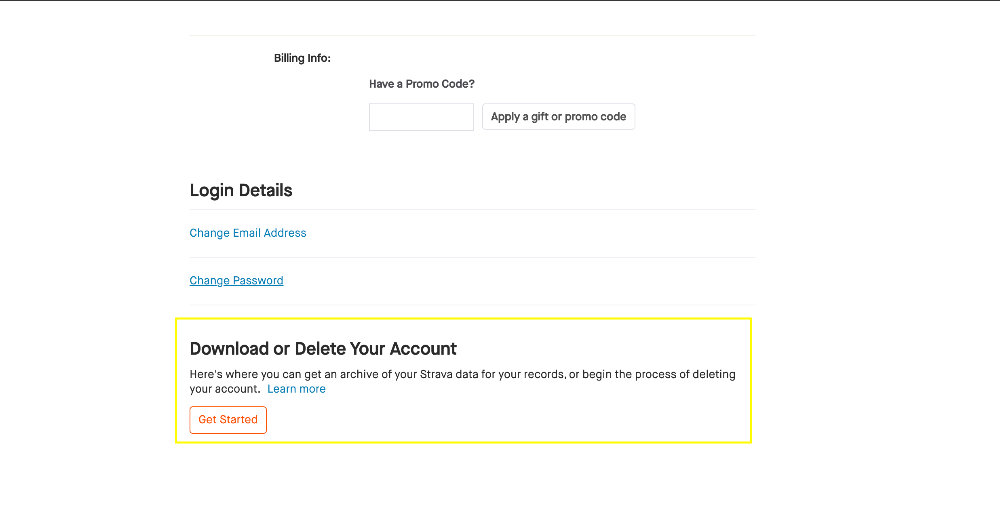
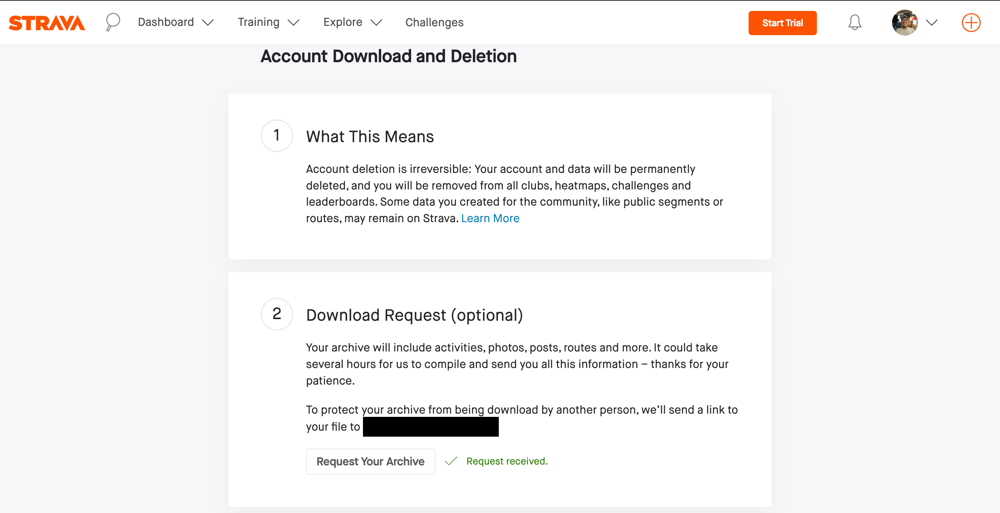
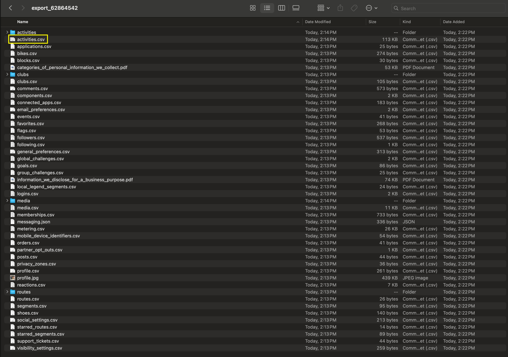
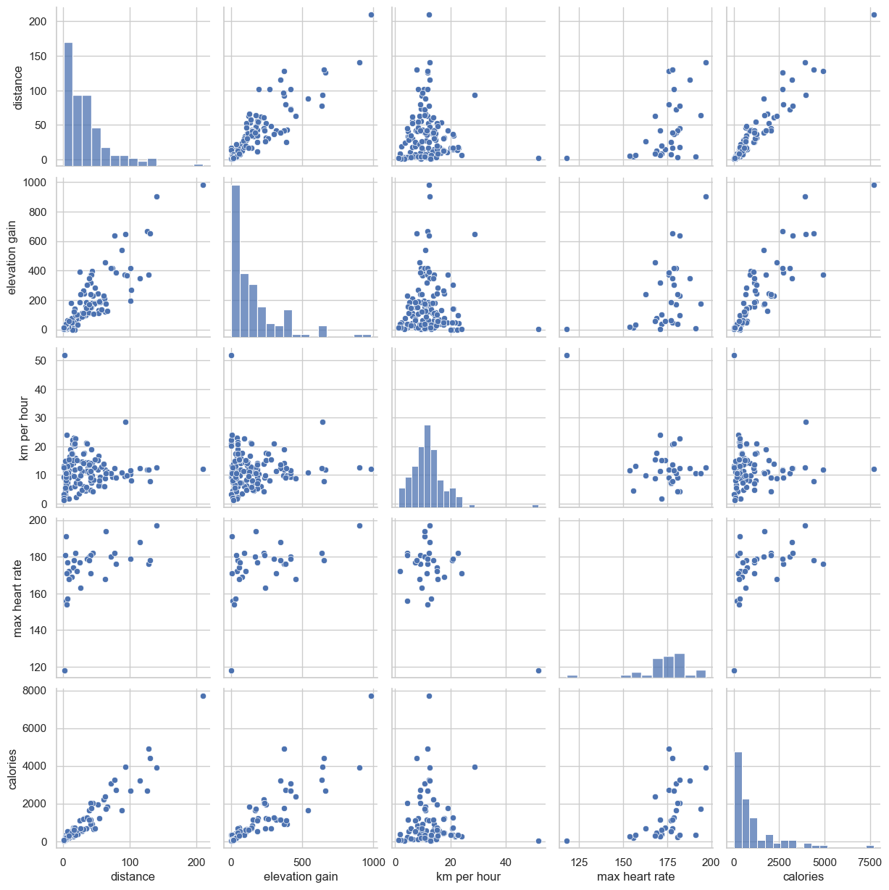
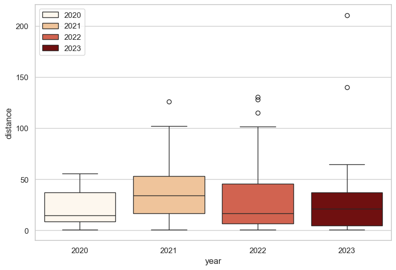
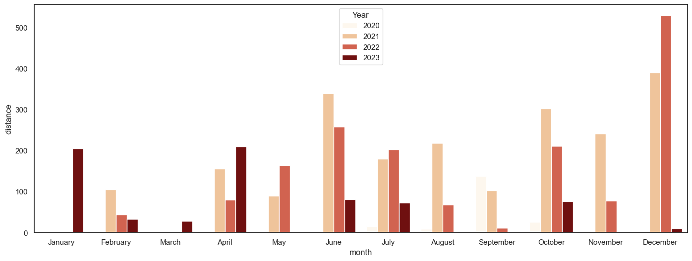
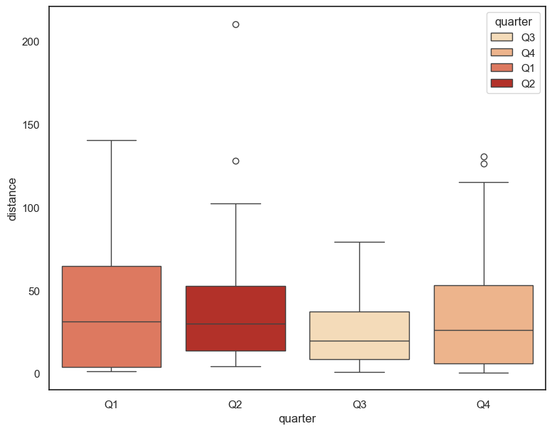

# Analyzing my Strava records using Python
<kbd style="background-color: #f0f0f0; padding: 2px 5px; border-radius: 3px;">Step-by-step guide to analyze your own Strava data using Python</kbd>

In this repo, I’ll be sharing the steps I took in performing an Exploratory Data Analysis (EDA) of my Strava data. In the first part, I'll share to you how was I able to get my Strava data and on the second part, I'll show you my results. To make this readme file short, please refer to this [Jupyter notebook](analyze-strava.ipynb) 🗒️🗒️🗒️ for the step by step codes that I used. I've been coding for quite some time and I realized that I haven't been making some decent projects hence this first one small analysis. 

## Getting your Strava data

For you to be able to do some analysis, of course you need to get your data. I got my data as a CSV file from the Strava website. To get it, you need to log in to your account then click the down arrow beside your profile picture in Strava then select My Account on the right. 

Afterwards scroll down the resulting page and click on "Get Started" button on the 'Download or Delete Your Account Section'. Don't worry, you'll not delete your account.

In the next page, head towards the 'Download Request (optional)' section and click the 'Request your archive' button. You'll see 'Request received' afterwards then the zip file will be sent towards your registered email.

The next step is to go over your email and get the zip file. This may be in your Spam/Junk folder depending on your settings. (At least that's where I found mine). Download and extract it and it should look like this:

The one you're interested with is the 'activities.csv' file. This is the one that we'll use in our analysis.

Then, you can proceed in making a Jupyter Notebook in the IDE of your choice. I did this analysis using VSCode. For the step-by-step code, please refer to this [Jupyter notebook](analyze-strava.ipynb).

## Exploratory Data Analysis

After cleaning the data, I started by showing the summary statistics table for ease of inspecting the usual statistical values that I'm interested with. Afterwards, I created a pairs plot chat which will illustrate the distribution of the variables and its relationship with the other variables. Then I made a box-plot to visually show the dispertion of my ride data and if there are signs of skewness. Then, I proceeded with illustrating the distance per month that I've covered through a bar plot. And lastly, I made another box-plot to see which quarter am I most actively riding my bike outdoors

<table border="1" class="dataframe">
  <thead>
    <tr style="text-align: right;">
      <th></th>
      <th>activity id</th>
      <th>elapsed time</th>
      <th>moving time</th>
      <th>distance</th>
      <th>max heart rate</th>
      <th>elevation gain</th>
      <th>max speed</th>
      <th>calories</th>
      <th>activity_date</th>
      <th>year</th>
      <th>dayofyear</th>
      <th>elapsed hour</th>
      <th>km per hour</th>
    </tr>
  </thead>
  <tbody>
    <tr>
      <th>count</th>
      <td>1.380000e+02</td>
      <td>138.0</td>
      <td>138.0</td>
      <td>138.0</td>
      <td>34.0</td>
      <td>138.0</td>
      <td>138.0</td>
      <td>86.0</td>
      <td>138</td>
      <td>138.0</td>
      <td>138.0</td>
      <td>138.0</td>
      <td>138.0</td>
    </tr>
    <tr>
      <th>mean</th>
      <td>6.892066e+09</td>
      <td>38999.0</td>
      <td>6876.0</td>
      <td>34.0</td>
      <td>176.0</td>
      <td>155.0</td>
      <td>12.0</td>
      <td>1078.0</td>
      <td>2022-03-18 23:33:04.362318848</td>
      <td>2022.0</td>
      <td>228.0</td>
      <td>11.0</td>
      <td>12.0</td>
    </tr>
    <tr>
      <th>min</th>
      <td>3.748056e+09</td>
      <td>171.0</td>
      <td>171.0</td>
      <td>1.0</td>
      <td>118.0</td>
      <td>0.0</td>
      <td>5.0</td>
      <td>20.0</td>
      <td>2020-07-04 12:57:37</td>
      <td>2020.0</td>
      <td>14.0</td>
      <td>0.0</td>
      <td>0.0</td>
    </tr>
    <tr>
      <th>25%</th>
      <td>5.807027e+09</td>
      <td>2619.0</td>
      <td>1843.0</td>
      <td>9.0</td>
      <td>171.0</td>
      <td>32.0</td>
      <td>10.0</td>
      <td>277.0</td>
      <td>2021-08-17 06:39:24.750000128</td>
      <td>2021.0</td>
      <td>168.0</td>
      <td>1.0</td>
      <td>8.0</td>
    </tr>
    <tr>
      <th>50%</th>
      <td>7.058098e+09</td>
      <td>7865.0</td>
      <td>4951.0</td>
      <td>25.0</td>
      <td>178.0</td>
      <td>104.0</td>
      <td>12.0</td>
      <td>579.0</td>
      <td>2022-04-29 05:08:36</td>
      <td>2022.0</td>
      <td>232.0</td>
      <td>2.0</td>
      <td>11.0</td>
    </tr>
    <tr>
      <th>75%</th>
      <td>8.008873e+09</td>
      <td>20309.0</td>
      <td>9597.0</td>
      <td>45.0</td>
      <td>181.0</td>
      <td>192.0</td>
      <td>14.0</td>
      <td>1239.0</td>
      <td>2022-10-23 22:42:44</td>
      <td>2022.0</td>
      <td>299.0</td>
      <td>6.0</td>
      <td>14.0</td>
    </tr>
    <tr>
      <th>max</th>
      <td>1.056717e+10</td>
      <td>3055629.0</td>
      <td>38296.0</td>
      <td>210.0</td>
      <td>241.0</td>
      <td>982.0</td>
      <td>23.0</td>
      <td>7699.0</td>
      <td>2023-12-29 05:53:09</td>
      <td>2023.0</td>
      <td>365.0</td>
      <td>849.0</td>
      <td>52.0</td>
    </tr>
    <tr>
      <th>std</th>
      <td>1.535680e+09</td>
      <td>264373.0</td>
      <td>6911.0</td>
      <td>35.0</td>
      <td>18.0</td>
      <td>178.0</td>
      <td>3.0</td>
      <td>1311.0</td>
      <td>NaN</td>
      <td>1.0</td>
      <td>89.0</td>
      <td>73.0</td>
      <td>6.0</td>
    </tr>
  </tbody>
</table>

The good thing about showing the summary statistics first is that you'll immediately see if there are some extreme and funky values through showing the minimum and maximum values. In my data, it can be observed my maximum elapsed time was 8489rs (Calculated as =3055629/60mins/60hrs) for which I couldn't think of any ride that I made where I was on the bike for that long. However, for the moving time, my max was at 10.63 hrs which was when I did my first Laguna Loop. 

Another funky value was my max heart rate which peaked at 241bpm? I don't have the best heart condition but I'm pretty sure that I won't reach that high of a heart rate. 

Those two might have skewed my data hence, I think we should exclude those before even proceeding with the other charts and analysis. As I recall, I haven't made an activity which lasted for more than 20 hours. With regard to my max heartrate, there were times that my heart rate monitor was acting strange that's why some of the readings were off. The max reasonable heart rate that I could recall was at 210bpm. Hence, I will set another filter to not include those rides with heart rate greater than 210bpm.

<table border="1" class="dataframe">
  <thead>
    <tr style="text-align: right;">
      <th></th>
      <th>activity id</th>
      <th>activity date</th>
      <th>activity type</th>
      <th>elapsed time</th>
      <th>moving time</th>
      <th>distance</th>
      <th>max heart rate</th>
      <th>elevation gain</th>
      <th>max speed</th>
      <th>calories</th>
      <th>activity_date</th>
      <th>start_time</th>
      <th>start_date_local</th>
      <th>month</th>
      <th>year</th>
      <th>dayofyear</th>
      <th>elapsed hour</th>
      <th>km per hour</th>
    </tr>
  </thead>
  <tbody>
    <tr>
      <th>1</th>
      <td>3748239651</td>
      <td>Jul 11, 2020, 9:51:06 PM</td>
      <td>Ride</td>
      <td>3789</td>
      <td>3115.0</td>
      <td>14.95</td>
      <td>NaN</td>
      <td>64.584747</td>
      <td>17.700001</td>
      <td>NaN</td>
      <td>2020-07-11 21:51:06</td>
      <td>21:51:06</td>
      <td>2020-07-11</td>
      <td>July</td>
      <td>2020</td>
      <td>193</td>
      <td>1.052500</td>
      <td>14.204276</td>
    </tr>
    <tr>
      <th>2</th>
      <td>3979407827</td>
      <td>Aug 28, 2020, 9:45:19 PM</td>
      <td>Ride</td>
      <td>2417</td>
      <td>1564.0</td>
      <td>8.76</td>
      <td>NaN</td>
      <td>12.994913</td>
      <td>11.300000</td>
      <td>NaN</td>
      <td>2020-08-28 21:45:19</td>
      <td>21:45:19</td>
      <td>2020-08-28</td>
      <td>August</td>
      <td>2020</td>
      <td>241</td>
      <td>0.671389</td>
      <td>13.047580</td>
    </tr>
    <tr>
      <th>3</th>
      <td>4051298220</td>
      <td>Sep 12, 2020, 10:17:13 PM</td>
      <td>Ride</td>
      <td>12127</td>
      <td>8909.0</td>
      <td>42.74</td>
      <td>NaN</td>
      <td>148.551956</td>
      <td>11.400000</td>
      <td>NaN</td>
      <td>2020-09-12 22:17:13</td>
      <td>22:17:13</td>
      <td>2020-09-12</td>
      <td>September</td>
      <td>2020</td>
      <td>256</td>
      <td>3.368611</td>
      <td>12.687722</td>
    </tr>
    <tr>
      <th>...</th>
      <td>...</td>
      <td>...</td>
      <td>...</td>
      <td>...</td>
      <td>...</td>
      <td>...</td>
      <td>...</td>
      <td>...</td>
      <td>...</td>
      <td>...</td>
      <td>...</td>
      <td>...</td>
      <td>...</td>
      <td>...</td>
      <td>...</td>
      <td>...</td>
      <td>...</td>
      <td>...</td>
    </tr>
    <tr>
      <th>194</th>
      <td>10386367323</td>
      <td>Dec 15, 2023, 11:27:39 PM</td>
      <td>Ride</td>
      <td>2055</td>
      <td>1802.0</td>
      <td>8.82</td>
      <td>168.0</td>
      <td>59.000000</td>
      <td>11.894043</td>
      <td>286.0</td>
      <td>2023-12-15 23:27:39</td>
      <td>23:27:39</td>
      <td>2023-12-15</td>
      <td>December</td>
      <td>2023</td>
      <td>349</td>
      <td>0.570833</td>
      <td>15.451095</td>
    </tr>
    <tr>
      <th>196</th>
      <td>10567168689</td>
      <td>Dec 29, 2023, 5:53:09 AM</td>
      <td>Ride</td>
      <td>4504</td>
      <td>446.0</td>
      <td>1.65</td>
      <td>NaN</td>
      <td>15.000000</td>
      <td>7.702002</td>
      <td>61.0</td>
      <td>2023-12-29 05:53:09</td>
      <td>05:53:09</td>
      <td>2023-12-29</td>
      <td>December</td>
      <td>2023</td>
      <td>363</td>
      <td>1.251111</td>
      <td>1.318828</td>
    </tr>
  </tbody>
</table>

After excluding those activities, I am now down to 135 records from having 138 records to start with. 
    

    

Using a pairs plot really is very useful as it gives you immediate visualization amongst the variables that you wanted to have an analysis with. 

As expected, we can observe that there is a positive relationship between distance and calories -- the longer the distance, the higher number of calories burned. For most of my rides under 100km, I've kept my speed under 30km/hr. And for those rides where I was able to record my heartrate, I was over 160bpm for most of them. This is definitely something that I can improve as I wanted to keep my efforts in Zone 2. And perhaps, I should replace my heart rate monitor. 

Next stop is making a box-plot chart for the distance I've covered.

    

First observation that immediately struct me is the lack of 2024 data. Then I realized that I wasn't able to record a bike ride outside as of writing this because I've suffered from a gout attack at the start of the year. I've mostly had indoor rides this year so far. 

Extremes was highest during 2023 where I did my Audax Populaire event in January (140km) and a Laguna Loop ride (>200km). In the previous years however, the distance of the rides that I do mostly range upto 100km with the majority being under 50km.

I then proceeded into illustrating the total distance that I've covered on a monthly basis.
    

Here, the total distance I covered per month was shown. there were no data for the first half of 2020 as I started recording my rides when I got my fixed gear in July. 

The most that I've done was during the December 2022 when I completed the Rapha Festive 500 challenge. 

I guess the best insight I wanted to make out of this is that I should ride more outside. 

    

And lastly, I created a box-plot for the quarterly analysis. Given the chart, it can be observed that I ride the most during the first quarter of the year. 

*Again, I should really ride more outside.*

## Thank you for going through this simple exploratory data analysis project that I did. I enjoyed coding this and generating insights from my cycling data. I plan to further improve this in the future and perhaps with better data after I replace my heart rate monitor. Please feel free to use this if you wanted to do a simple analysis on your cycling data as well. 

